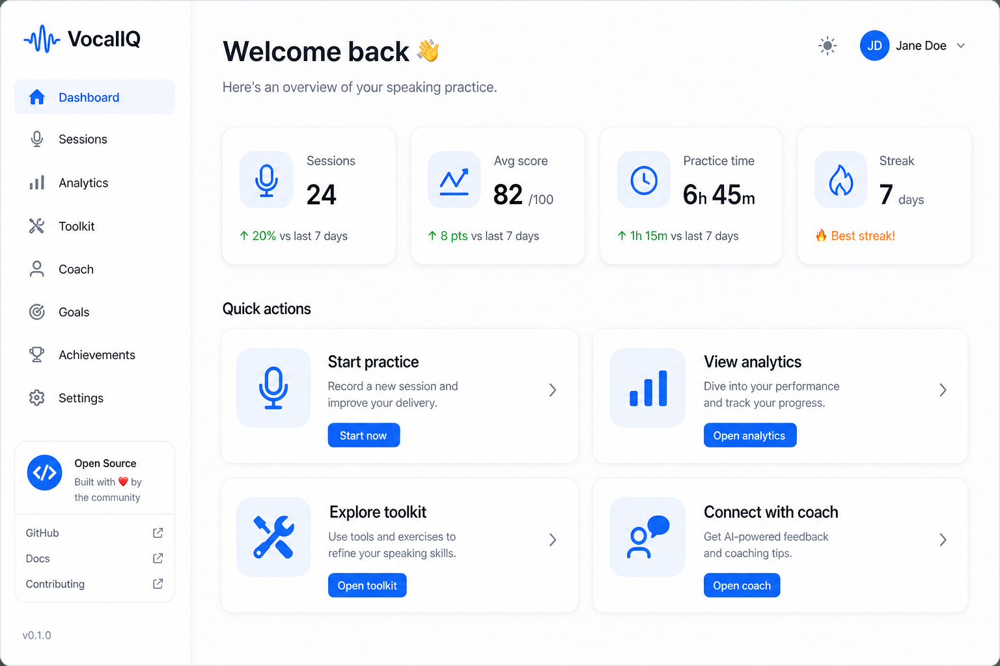
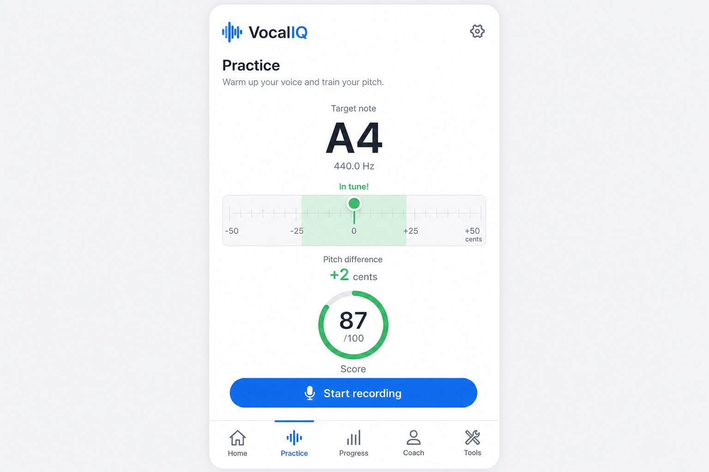
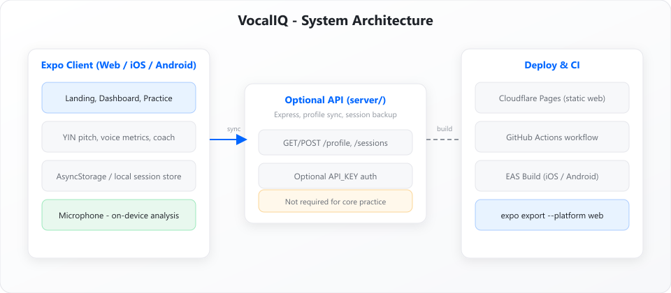
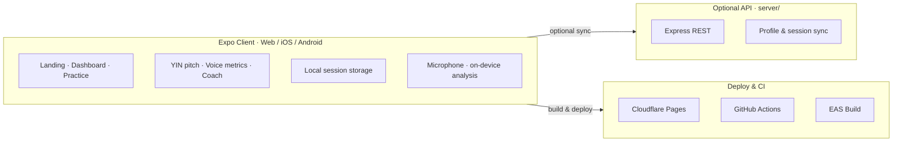

# VocalIQ

**Open-source real-time vocal training** — pitch feedback, voice scoring, coaching, analytics, and singer tools. Runs in the browser and on iOS/Android via Expo.

[](LICENSE)
[](https://expo.dev)
[](https://www.typescriptlang.org/)
[](https://predict-voice-quality.pages.dev)


**[Try it live](https://predict-voice-quality.pages.dev)** · **[Open source inventory](./docs/OPEN_SOURCE_INVENTORY.md)** · **[Architecture](./docs/ARCHITECTURE.md)**

---

## What is VocalIQ?

VocalIQ helps singers practice with **instant, on-device feedback**. Sing into your microphone and see:

- Live **pitch meter** (note, Hz, sharp/flat in cents)
- **Overall score** and skill breakdown
- **Coaching tips** based on your weakest dimension
- **Session history**, trends, and streaks
- **Toolkit**: tuner, metronome, scales, breath coach

Audio is analyzed **on your device** — nothing is uploaded unless you configure the optional API.

<p align="center">
  
  &nbsp;
  
</p>

---

## Features

| Area | Highlights |
|------|------------|
| **Practice** | YIN pitch detection, live pitch lane, score ring, metric cards |
| **Progress** | Trend charts, skill breakdown, session history |
| **Coach** | Practice plans, milestones, AI-style coaching agent |
| **Tools** | Chromatic tuner, metronome, scale guide, breath coach, range map |
| **Web** | Full experience in modern browsers (mic permission required) |
| **Mobile** | Expo Go or EAS builds for iOS/Android |

---

## Quick start

### Prerequisites

- [Node.js](https://nodejs.org/) 20+
- npm 9+
- Microphone access (browser or device)

### Install & run (web)

```bash
git clone https://github.com/akhilvydyula/predict-voice-quality.git
cd predict-voice-quality
npm install
npm run web
```

Open the URL shown in the terminal (usually `http://localhost:8081`), go to **Practice**, and allow microphone access.

### Run on phone (Expo Go)

```bash
npm start
```

Scan the QR code with **Expo Go** (Android) or **Camera** (iOS).

### Optional API server

```bash
npm install --prefix server
npm run api          # dev server on :3001
```

Set `EXPO_PUBLIC_API_URL=http://localhost:3001` if you want profile/session sync.

### Production web build

```bash
npm run build:web
# Output in dist/ — deploy to Cloudflare Pages, Netlify, etc.
npm run deploy:cloudflare   # requires Wrangler auth
```

---

## Project structure

```
predict-voice-quality/
├── app/                 # Expo Router screens
├── src/
│   ├── audio/           # Pitch detection & voice scoring
│   ├── components/      # UI, charts, landing, tools
│   ├── hooks/           # useVoiceAnalysis, metronome, breath
│   ├── agent/           # Coaching agent & singer profile
│   ├── analytics/       # Dashboard metrics
│   ├── storage/         # Local persistence
│   └── theme/           # Design tokens
├── server/              # Optional Express API
├── docs/                # Architecture, inventory, images
├── assets/              # App icons & splash
└── scripts/             # Cloudflare dist preparation
```

---

## Voice quality dimensions

| Metric | What we measure |
|--------|-----------------|
| **Pitch** | Closeness to correct pitch (cents) |
| **Stability** | Steadiness when holding notes |
| **Breath** | Even volume / support |
| **Tone** | Signal clarity (harmonic confidence) |
| **Vibrato** | Controlled pitch oscillation |
| **Dynamics** | Expressive volume range |

Scoring logic lives in [`src/audio/voiceQuality.ts`](src/audio/voiceQuality.ts).

---

## Architecture





Details: [docs/ARCHITECTURE.md](./docs/ARCHITECTURE.md) · [Agent workflow](./docs/AGENT_WORKFLOW.md)

---

## Open source

This project is **MIT licensed** — free to use, modify, and distribute.

| Resource | Link |
|----------|------|
| **Maintainer** | [Akhil Vydyula](https://github.com/akhilvydyula) |
| Authors & git attribution | [AUTHORS.md](./AUTHORS.md) |
| Contributors | [CONTRIBUTORS.md](./CONTRIBUTORS.md) |
| Full inventory (code, docs, images, deps) | [docs/OPEN_SOURCE_INVENTORY.md](./docs/OPEN_SOURCE_INVENTORY.md) |
| Third-party licenses | [THIRD_PARTY_NOTICES.md](./THIRD_PARTY_NOTICES.md) |
| Contributing | [CONTRIBUTING.md](./CONTRIBUTING.md) |
| Code of conduct | [CODE_OF_CONDUCT.md](./CODE_OF_CONDUCT.md) |
| Security | [SECURITY.md](./SECURITY.md) |

---

## Deploy your own instance

**Cloudflare Pages** (used by the live demo):

1. Fork this repo
2. Connect to Cloudflare Pages
3. Build command: `npm run build:web`
4. Output directory: `dist`
5. Add GitHub secrets `CLOUDFLARE_API_TOKEN` and `CLOUDFLARE_ACCOUNT_ID` for CI, or deploy manually with Wrangler

See [`.github/workflows/deploy-cloudflare.yml`](.github/workflows/deploy-cloudflare.yml).

---

## Roadmap

- [ ] Song mode with reference melody comparison
- [ ] Export session data (CSV/JSON)
- [ ] Persistent API store (Postgres / SQLite)
- [ ] EAS store builds with signed releases
- [ ] i18n / localization

Contributions welcome — see [CONTRIBUTING.md](./CONTRIBUTING.md).

---

## License

Copyright © 2026 [Akhil Vydyula](https://github.com/akhilvydyula)

Released under the [MIT License](LICENSE).

---

<p align="center">
  
  <br />
  <strong>VocalIQ</strong> — vocal training, visualized.
</p>
